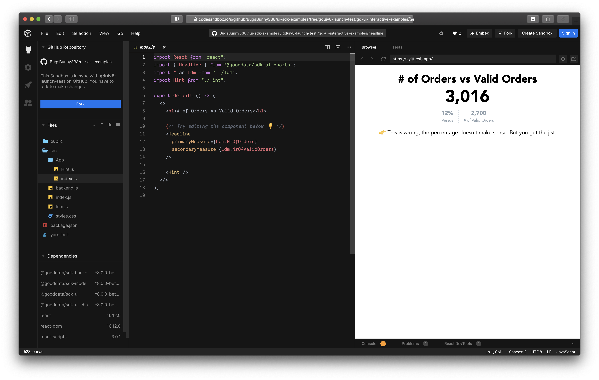

# GoodData.UI SDK - Interactive Examples - Headline

You can run this example in [CodeSandbox](https://codesandbox.io/s/github/BugsBunny338/ui-sdk-examples/tree/gduiv8-launch-test/gd-ui-interactive-examples/headline?file=/src/App/index.js). Navigate [up](..) for more information.

## License

(C) 2017-2020 GoodData Corporation

This repository is under the GoodData commercial license available in the [LICENSE](LICENSE) file because it contains a commercial package, HighCharts. Subdirectories containing the MIT license are not subject to the GoodData commercial license and do not contain any commercial code.
