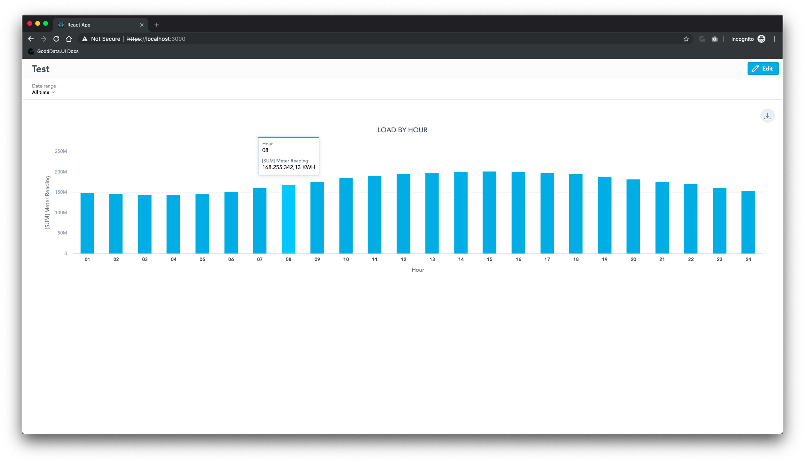
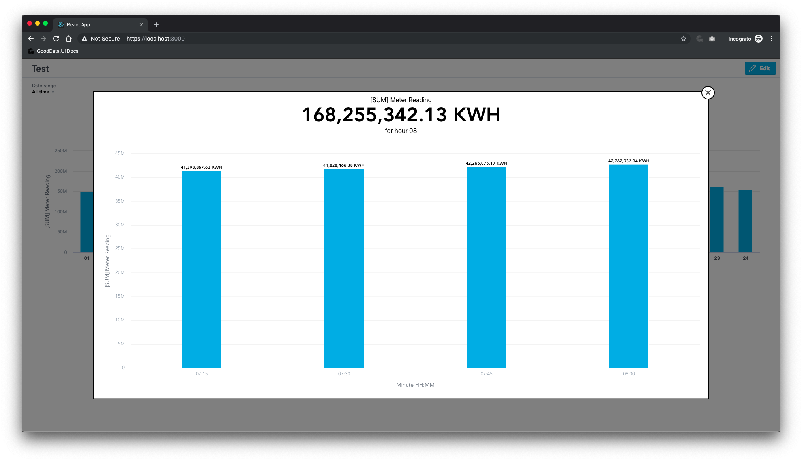

# KPI Dashboards Drilling Over Huge Dataset (2B Rows)

This app demonstrates how to implement drilling in KPI Dashboards.

## Live demo

There is no live demo, since this runs against https://secure.gooddata.com/ where there is no CORS allowed.

## How to run locally

* `git clone --depth 1 --single-branch --branch kpi-drill-large-dataset https://github.com/BugsBunny338/ui-sdk-examples.git`
* `cd ui-sdk-examples/kpi-drill/`
* `yarn install --pure-lockfile` (or `npm install`)
* `yarn start` or `GD_URL=secure.gooddata.com yarn start`

## How to build for deployment

This demo won't work when deployed becase of CORS. It is only meant to be run at localhost using proxy settings.

## Backend/proxy info

This app is configured to run against https://secure.gooddata.com/.

## Compatibility

An ES6 [@babel/polyfill](https://babeljs.io/docs/en/babel-polyfill) was added to support Internet Explorer.

## Screnshots

---

This project was bootstrapped with [Create React App](https://github.com/facebook/create-react-app).
